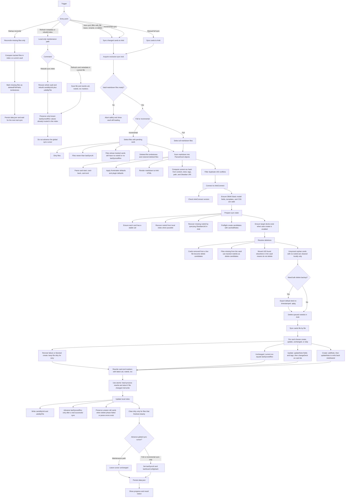

# obak

Obsidian desktop plugin for staged one-way sync from Obsidian card blocks into Anki.

## Current status

Phase 1 to phase 4 are implemented:

- Parse `card-start` / `card-back` / `card-end` blocks.
- Validate card syntax per file.
- Generate stable local `uid` values and `rev` hashes.
- Rewrite `card-end` metadata atomically with `Vault.process()`.
- Persist a local index for future sync and deletion phases.
- Connect to Anki through AnkiConnect.
- Auto-create and validate the `OBAK Basic` model before syncing.
- Auto-create missing decks before adding notes.
- Create new notes with `addNote`.
- Update existing notes with the custom field set and `changeDeck`.
- Delete removed notes through the pending delete queue.
- Handle file-path reconciliation at startup.
- Preserve note mappings across file renames.
- Store the Obsidian source URI in a dedicated note field rendered by the card template.
- Convert remote Markdown embeds like `` into Anki-ready HTML media tags.

Planned next phases:

- Future work can focus on deeper UX polish and end-to-end integration tests.

## Card syntax

```md
<!-- card-start deck="Biology::Energy" tags="atp,cell" -->
What does ATP stand for?
<!-- card-back -->
Adenosine Triphosphate
<!-- card-end uid="..." rev="sha256:..." -->
```

Remote media embeds are supported inside the Front and Back content. The sync step converts Obsidian-style external embeds into HTML that Anki can render based on the URL extension:

- Images: `png`, `jpg`, `jpeg`, `gif`, `webp`, `svg`, `avif`, `bmp`, `apng`
- Audio: `mp3`, `wav`, `ogg`, `oga`, `opus`, `m4a`, `flac`, `aac`
- Video: `mp4`, `webm`, `mov`, `m4v`, `ogv`

Example:

```md
<!-- card-start -->
Name the structure shown below.
<!-- card-back -->

<!-- card-end -->
```

Supported file defaults:

```md
---
anki-deck: Biology::Cell
anki-tags: [bio, exam]
---
```

Deck priority is:

- Explicit `deck="..."` on `card-start`
- `anki-deck` in file frontmatter
- `Default deck::vault::relative::file`
- `Default deck`

## Commands

- `Sync cards to Anki`
- `Sync changed cards to Anki`
- `Insert card template`
- `Validate card syntax in current file`
- `Refresh card metadata in current file`
- `Rebuild sync index`

## Sync flow



Key points:

- `data.json` is the local sync state store. The important fields are `cardsByUid`, `uidsByFile`, `pendingDeleteNoteIds`, `deletedFilePaths`, `lastSyncAt`, and `lastScanConfigHash`.
- `Refresh card metadata in current file` and `Rebuild sync index` are maintenance commands. They can rewrite local markers and rebuild index state, but they do not claim that Anki is already in sync.
- Incremental sync is not only `dirty + mtime`. It also revisits files whose tracked cards still have incomplete sync state, such as missing `noteId` or missing `lastSyncedRev`.
- File deletion is intentionally two-phase: vault events and startup reconcile only record tombstones locally, and a later sync run performs the actual Anki deletion.
- A file is cleared from the dirty set only when its remote sync path finishes cleanly. Remote failures stay eligible for retry on the next incremental sync.

## Development

- `npm install`
- `npm run dev`
- `npm run build`
- `npm run lint`

The project pins Node and npm with Volta in `package.json`.

## Releases

Push a version tag that exactly matches `package.json` and `manifest.json` to build and publish the plugin assets to GitHub Releases automatically.

- Update the version with `npm version patch`, `npm version minor`, or `npm version major`.
- Push the commit and tag with `git push origin main --follow-tags`.
- The release workflow uploads `main.js`, `manifest.json`, and `styles.css`.

If you prefer creating releases in the GitHub UI, publishing a release for an existing version tag runs the same workflow and refreshes the uploaded assets.
