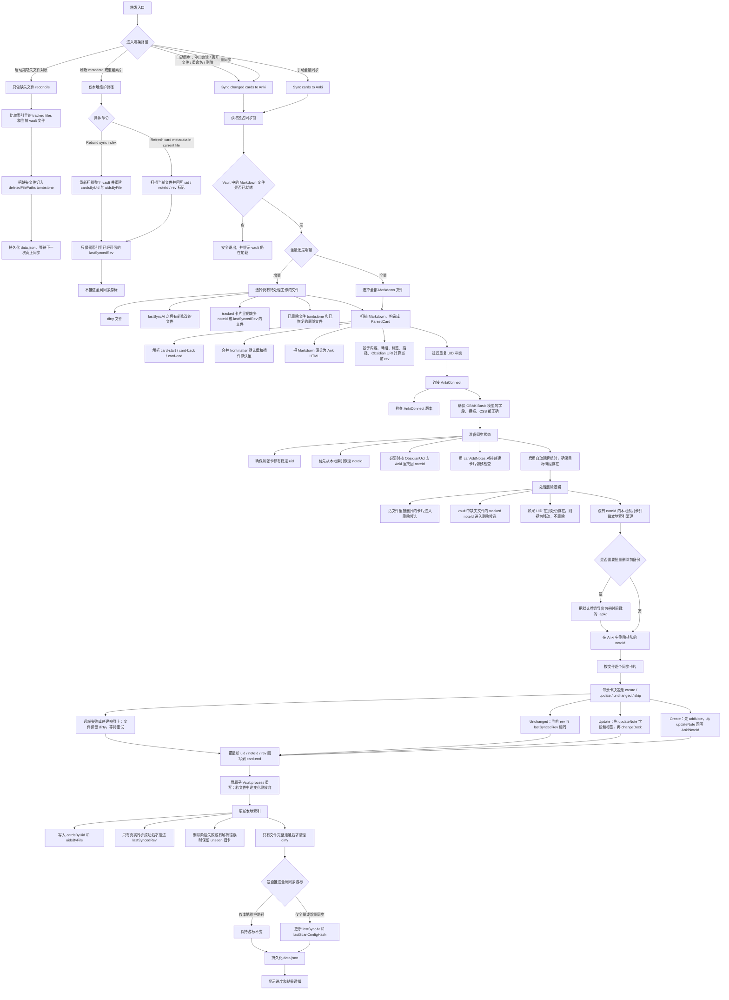

# obak

Obsidian 桌面插件，用于把 Markdown 卡片块按阶段、单向同步到 Anki。

英文版说明见 `README.md`。

## 当前状态

目前已实现第 1 阶段到第 4 阶段：

- 解析 `card-start` / `card-back` / `card-end` 卡片块。
- 按文件校验卡片语法。
- 生成稳定的本地 `uid` 和 `rev` 哈希。
- 通过 `Vault.process()` 原子重写 `card-end` 元数据。
- 持久化本地索引，用于后续同步和删除阶段。
- 通过 AnkiConnect 连接 Anki。
- 同步前自动创建并校验 `OBAK Basic` 模型。
- 添加新笔记前自动创建缺失的牌组。
- 使用 `addNote` 创建新笔记。
- 使用自定义字段集和 `changeDeck` 更新已有笔记。
- 通过待删除队列删除已移除的笔记。
- 在启动时处理缺失文件对账。
- 在文件重命名后保留笔记映射关系。
- 在专用字段中保存 Obsidian 源文件 URI，并在卡片模板中渲染。
- 将远程 Markdown 嵌入（如 ``）转换成 Anki 可渲染的 HTML 媒体标签。

后续计划：

- 下一步主要可以继续补 UI 体验和端到端集成测试。

## 卡片语法

```md
<!-- card-start deck="Biology::Energy" tags="atp,cell" -->
What does ATP stand for?
<!-- card-back -->
Adenosine Triphosphate
<!-- card-end uid="..." rev="sha256:..." -->
```

支持在正面和背面内容中使用远程媒体嵌入。同步时会把 Obsidian 风格的外链嵌入转换成 Anki 可渲染的 HTML，转换规则按 URL 扩展名判断：

- 图片：`png`、`jpg`、`jpeg`、`gif`、`webp`、`svg`、`avif`、`bmp`、`apng`
- 音频：`mp3`、`wav`、`ogg`、`oga`、`opus`、`m4a`、`flac`、`aac`
- 视频：`mp4`、`webm`、`mov`、`m4v`、`ogv`

示例：

```md
<!-- card-start -->
Name the structure shown below.
<!-- card-back -->

<!-- card-end -->
```

支持的文件默认值：

```md
---
anki-deck: Biology::Cell
anki-tags: [bio, exam]
---
```

牌组优先级：

- `card-start` 上显式声明的 `deck="..."`
- 文件 frontmatter 里的 `anki-deck`
- `默认牌组::vault::relative::file`
- `默认牌组`

## Commands

- `Sync cards to Anki`
- `Sync changed cards to Anki`
- `Insert card template`
- `Validate card syntax in current file`
- `Refresh card metadata in current file`
- `Rebuild sync index`

## 同步流程



关键点：

- `data.json` 是本地同步状态的核心存储。最重要的字段包括 `cardsByUid`、`uidsByFile`、`pendingDeleteNoteIds`、`deletedFilePaths`、`lastSyncAt` 和 `lastScanConfigHash`。
- `Refresh card metadata in current file` 和 `Rebuild sync index` 都属于维护命令。它们会重写本地标记、重建索引，但不会宣称 Anki 已经同步完成。
- 增量同步不只是 `dirty + mtime`。它还会重新纳入那些 tracked 卡片同步状态还不完整的文件，比如缺少 `noteId` 或缺少 `lastSyncedRev`。
- 文件删除是两阶段流程：vault 事件和启动期 reconcile 先只记本地 tombstone，后续某次真正同步再去执行 Anki 删除。
- 只有当文件的远端同步路径完整走通后，才会从 dirty 集合里移除；远端失败会保留重试资格，等待下一次增量同步。

## Development

- `npm install`
- `npm run dev`
- `npm run build`
- `npm run lint`

项目在 `package.json` 里通过 Volta 固定了 Node 和 npm 版本。

## Releases

推送一个与 `package.json` 和 `manifest.json` 完全一致的版本标签后，GitHub Releases 工作流会自动构建并发布插件产物。

- 使用 `npm version patch`、`npm version minor` 或 `npm version major` 更新版本。
- 使用 `git push origin main --follow-tags` 推送提交和标签。
- 发布工作流会上传 `main.js`、`manifest.json` 和 `styles.css`。

如果你更喜欢在 GitHub UI 里手动创建 release，只要针对已存在的版本标签发布 release，也会触发同一套工作流并刷新上传产物。
